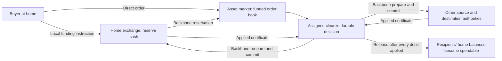

# Milestone 1: a funded, federated solar-system exchange

**Design version 1.0. Governing input: Participant Brief released October 2, 2026.**

This is a system design and research report, not the 12-page submission paper. It specifies the operating rules to carry into Milestone 2, supplies executable checks, and distinguishes completed evidence from experiments that still need the complete transport simulator. No empirical result below is an unconditional delivery promise. No organizer clarifications were supplied; they must be checked before submission.

## A. Decision and executive summary

Keep the nine planetary exchanges. Use **two clearing services, operated by the Mars and Neptune exchanges**, with disjoint, fixed product partitions. A service inside an existing institution does not need a new identity or additional direct quota. Thus the recommended charter has nine institutions, not eleven. If organizationally separate clearers are desired, eleven institutions fit the limit, but that is not required for correctness and must not be used to manufacture client capacity.

The baseline supports fully funded equity trades, asset transfers, and fully collateralized capped cash-settled futures. Unbounded futures, unsecured loans, naked options, cross-clearer portfolio margin, and rehypothecation are not supported. Their absence is a deliberate funding decision, not an assumption that delayed margin calls will succeed.

Five rules make the architecture precise:

1. Each instrument has one master registry and market authority. Each **spendable unit** has exactly one active spending authority. Shares held remotely use explicitly allocated custody balances, never independent copies of the same share.
2. Cash is a conserved ledger asset, initially authoritative where the opening balance sheet places it. Cash changes location only through a recorded debit, uniquely identified in-transit export, and corresponding destination activation. NeoDollars are not nine separately issued currencies.
3. Client orders may travel directly, but **funding reservations and every inter-exchange state change travel over the backbone**. An unconfirmed funding claim cannot enter the executable book.
4. Each transaction has one immutable clearer. All debits and destination acceptance are prepared before a commit decision. Destinations do not release spendable value until the clearer has certificates that **every participant applied the decision**.
5. Financial commitments survive session expiry, packet expiry, resets, and model windows. A prepared participant never releases funds on its own timeout. Recovery can block, but cannot mint money or reassign pledged assets.

The principal cost is capital immobilization and extra messages. In the worked Earth–Mars trade, a cold-session conditional completion takes **4.524640 hours**, uses **8 backbone originations**, and produces **68 backbone launches plus one direct launch**. The required direct order arrives with probability **0.871073** absent a closure/incident; the backbone trace is conditional on no random loss. Lost direct orders leave the transaction incomplete, with the reservation recoverable only through the published cancellation procedure.

### Authority and settlement flow



Internal roles at the same institution are local operations. Every inter-exchange arrow that changes shared financial state uses the backbone, including arrows whose labels are abbreviated above.

### What changes from the original proposal

| Original sketch | Final rule | Reason |
|---|---|---|
| Match first, then ask whether money exists | Confirm reservation before executable priority; prepare exact fills afterward | An unfunded early order must not immobilize the seller's inventory |
| Cash belongs to a client's home exchange | Home is the default access point; actual cash location and spending authority are explicit | Remote escrow or receipts are not local cash |
| Asset has one authoritative exchange | One master registry plus nonoverlapping delegated custody lots | Preserves issuance while allowing genuine local use of delivered shares |
| Both locks confirmed, then send commit | Prepare → commit → applied certificates → release | Separates irrevocable claims from local spendability |
| Two or three independent clearing institutions | Two services inside existing exchange institutions | Separate identities do not improve the backbone quota |
| Margin protects an otherwise unbounded obligation | Contractual loss cap is fully funded at opening | Arbitrary communication delay makes a finite margin-only guarantee unsafe |
| Unique ID prevents duplicates | Durable request ID, immutable payload, account version and closed-sequence floor | Prevents replay across sessions and bounded-record garbage collection |

## B. Source hierarchy, requirements, and invariants

**Fixed rules:** brief Section 2 takes precedence over other brief text; supplied frozen elements define baseline motion. Organizer clarifications, if supplied later, can supersede the brief. `architecture.pdf`, `idea.txt`, and `research_prompt.txt` are design inputs, not governing constraints.

**Source issue:** `data.zip` contains 12 files, including elements, network model, README and nine Horizons responses. It contains no reference propagator or separate test-vector file, despite the brief's description. The implementation uses the explicit equations and printed epoch table instead. It does not query or substitute live orbital data.

**CSV assessment:** six cross-check dates from day 0 through day 73,050 agree with the fixed-element implementation to at most 5.39×10⁻⁹ AU in the sampled body vectors. This strongly suggests that the exported daily file is consistent with this model, but does not establish its provenance. It cannot resolve sub-day contact boundaries or moving-receiver flight paths; it is not used to drive the simulator.

### Governing constraint table

| ID / brief section | Fixed requirement | Architectural consequence / verification |
|---|---|---|
| R01 / 2–3 | Epoch 2026-09-22 00: 00 TDB; 2126 is a story label | Seconds from the physical epoch; no initial 100-year advance |
| R02 / 2–3 | Sun-centered geometric 3D J2000 ecliptic AU; independent fixed Kepler ellipses | Propagate supplied `n`; do not infer it from a different solar mass |
| R03 / 2–3 | Relays at √8 AU, phases 45°/135°, prograde circular | Fixed relay elements in supplied network data |
| R04 / 2–3 | Photon equation, 8.317 min/AU; arrival tolerance 1 ms | Iterate receiver position; compute reverse flights separately |
| R05 / 2–3 | Segment crosses opaque sphere of radius 0.10 AU → unavailable | Closest point on emission-to-arrival segment, clamped to endpoints |
| R06 / 2–5 | Nineteen two-way backbone links; routes simple, ≤3 links, session-pinned | Enumerate A, B, A→B, B→A paths; no gateway-to-gateway backbone shortcut |
| R07 / 2–4 | 1 s serialization each launch; 1 s relay processing | Distinguish ready, emission, reception and next-link ready |
| R08 / 2–4 | Direct pays sending and receiving 1 s local access; same-settlement client message 1 s, free | Backbone has no local-access charge; a local instruction is not a direct packet |
| R09 / 2–4 | Backbone loss 1−exp(−0.02d); direct 1−exp(−0.08d) | Recompute actual path length at every emission, including receipts |
| R10 / 2–4 | Independent per-launch loss; no second route-level loss | Sample individual transmissions, not entire transactions |
| R11 / 2–4 | 1024-byte packets, 64-byte transport header, 960-byte payload; fixed-width, uncompressed | Bounded application records, batching with a declared envelope |
| R12 / 2–4 | Direct: 12 per principal rolling 24 h, ≥60 s spacing | Institutions cannot reply freely to every remote client; local status preferred |
| R13 / 2–4 | Backbone: 600 application originations rolling 24 h globally | Static institution budgets sum to 600; more clearers do not add capacity |
| R14 / 4 | SYN, application control, resubmission charged; automatic transport retry/ACK exempt | Two counters: charged originations and all physical launches |
| R15 / 2–5 | Directed-link FIFO, 1 packet/s, queue 10,000, newest discarded | Application admission and bounded reconnect batches; receipts consume capacity too |
| R16 / 2–5 | Simultaneous arrivals: sender node ID then packet creation sequence | Apply before ledger sequence allocation; preserve within-packet record index |
| R17 / 5 | Hop receipt one-shot; ≤4 launches; R_h=2 flight+60 min | Lost receipt does not undo delivered data; abandonment is delivery-unknown |
| R18 / 5 | SYN/SYN-ACK/final ACK; initiator sends after queuing final ACK | Receiver gates application release on final ACK; no instant handshake |
| R19 / 5 | Endpoint ≤4 attempts; R_e=2T0+24 h; retry gets fresh network ID | Preserve session byte sequence and application request ID; original lifetime persists |
| R20 / 5 | Retry enqueue consumes endpoint attempt even if queued behind closure | Replace older unlaunched copy; do not accumulate four queued copies |
| R21 / 2–5 | 64 unacknowledged packets/peer; application delivery in order | Financial release conditions are separate from transport ACKs |
| R22 / 2–5 | Packet 30 days; duplicate records lifetime plus 30 days after last receipt | Expiry never releases financial collateral |
| R23 / 2–5 | Session idle expiry 7 days; reset kills session state, not durable finance or packet IDs | Fresh handshake and charged recovery packets; ignore dead-session arrivals |
| R24 / 2–5 | B–Neptune [2, 26), B–Ceres [240,264), both ways, once | Reject a launch whose flight interval overlaps maintenance, even if emitted before it |
| R25 / 5 | 72 h gateway isolation / 6 h forced loss / endpoint reset; unannounced | Incident effect decided at emission; do not give scheduler foreknowledge |
| R26 / 3–4 | Client identities unforgeable; operators honest but crash/reset/isolate | Durable local transactions assumed; malicious operators excluded baseline |
| R27 / 3–4 | Official shared financial-state messages must use backbone | No client-carried lock certificate can create remote spending authority |
| R28 / 6 | 4–10 named accounts, ≥3 settlements, ≤$500k, ≤5000 shares; institutions zero | Six-account opening book below; all capital transfers traced |
| R29 / 6 | Pre-0 only session setup, ≥−168 h; all traffic counts | Worked run uses cold sessions and no pre-epoch activity |
| R30 / 6 | Value move; ≥240 h obligation; two products; separate ≥20% up/down paths | Equity trade plus 300-hour capped futures, independent resets |
| R31 / 6–7 | ≥25% opening cash encumbered simultaneously; real constraint must bind | $160k futures collateral =32%; oversized contract must suspend |
| R32 / 6–7 | One ex-ante margin rule; interim + final payments count once | Symmetric maximum-loss funding; no interim cash payouts |
| R33 / 6 | Price source, location, release frequency, one local signed packet specified | Bob publishes locally on Mars; official redistributions are backbone |
| R34 / 6 | Completion is spendability at own settlements plus matching debits | Report decision, backed claim, discharge, spendability and coordinator knowledge separately |
| R35 / 6–9 | Every settlement has access, including a later-price product | Local custody, funded access to Mars contract, conditional remote service everywhere |
| R36 / 7 | Closed funding, exclusive backing, no institutional free reserves | Conservation invariant includes in-transit exports; claims not counted again as money |
| R37 / 7–8 | Direct probability by deadline; hop launch and abandonment probabilities | No-loss time is labeled; receipts included in abandonment bounds |
| R38 / 7 | Peak encumbrance, asset-hours by asset, settled value, capital/communication efficiency | Explicit output schema and worked metrics below |
| R39 / 8 | S1/S2/S3 including maintenance-off and same-guarantee alternative | Test designs fixed below; full evidence completion belongs to Milestone 2 |
| R40 / 8 | ≥200 Julian years, refinement; +1/+10/+100 and difficult epoch | Hourly 200-year scan completed; exact route screening limits disclosed |
| R41 / 9 | No horizon reset; bounded storage/IDs; finite accepted demand | Active liabilities retained, backpressure, identifier lifetime and renewal rules |
| R42 / 9–10 | Two numeric deployment effects; 12+12 pages; ≥10 pt, ≥1-inch margins | Sources and estimates below; future paper/appendix must be separately typeset |

### Safety invariants

I1. For each conserved asset, opening quantity = live authoritative balances + uniquely owned locked balances + nonduplicated in-transit quantities. A locked balance is a classification of the owner's balance, not additional assets.

I2. For every lot, `available + reserved + prepared + locked_for_contract = owned`, with nonnegative integer quantities. Staged destination claims are memorandum claims against the export and are not an additional available asset.

I3. At most one participant can issue spend instructions for a given unit/version. The master share registry's custody allocation is not an independent spendable position.

I4. A reservation names one controller and one instrument/order budget. Aggregate committed fills plus live prepared slices never exceed it.

I5. A transaction has exactly one immutable COMMIT or ABORT. All participants verify transaction digest, authority epoch and reservation version.

I6. A home balance becomes spendable only from local unlocked assets or a RELEASE certificate covering all required applied debits. Transport receipts never authorize spending.

I7. Every price position has escrow at least equal to its contractual maximum loss on each side. There is no reliance on future fundraising, price continuity or arrival of a margin call.

I8. Neither a timeout nor any packet, session, scenario or ephemeris horizon extinguishes an unresolved obligation.

**Assumptions:** atomic durable journal writes and a durable outbox per institution; common model time; operator identity authentication from the brief; local CPU/storage capacity within declared limits; the named oracle defines a contractual index rather than claiming an objectively infallible price. Total destruction of durable storage and malicious operator behavior are extensions. No assumption of eventual delivery is needed for safety. Eventual recovery does require recurring usable paths, fair quota scheduling and successful future transmissions.

## C. Authority, cash, custody and services

### Institutional charter

`X1...X9` reside at the respective gateways. Each runs local accounts, custody, reservations, journal/outbox, and the market for its registered instruments. `C_M` is a service of Mars X4; `C_N` a service of Neptune X9. Clearer IDs identify services, not extra principals. Same-gateway internal service transitions are durable local operations; they do not invent an interplanetary link.

Static registry version 1 assigns Neptune-authoritative instruments to C_N and all other instruments to C_M. Every fill inherits its instrument's clearer and registry version. Pure transfers are cleared by the source asset's registered partition; transferring an already delegated share uses its original instrument partition, not the seller's location. Cash-only transfers use C_N when the source authority is Neptune, otherwise C_M. The source authority may change only by a completed transfer. Existing transactions never switch clearers because of latency or outage.

No atomic trade may combine instruments assigned to different clearers. A two-leg strategy is two separately funded trades with disclosed execution risk. Cross-clearer collateral offsets, common default funds and automatic failover are prohibited. Exchanges may hold separately reserved lots for both clearers, but no lot backs both.

### State ownership

| State | Sole writer | Remote representation |
|---|---|---|
| Instrument definition, issued quantity, custody allocation | Instrument master exchange | Versioned reference data |
| Client's spendable cash | Its current ledger authority | Advisory balance snapshot |
| Beneficial ownership inside a delegated custody lot | Delegated home exchange | Master records allocation, not a second beneficial balance |
| Order book and order revisions | Asset market exchange | Stale snapshots with sequence/time |
| Cash/share reservation | Current spending authority | Official reservation acknowledgment |
| Match and price/time priority | Asset market exchange | Immutable fill record |
| Commit/abort, position, payoff, obligation discharge | Assigned clearer | Immutable decision and status certificates |
| Physical packet/session state | Relevant transport endpoint/relay | Never a financial ledger |

**Cash migration:** source prepares a debit and destination prepares acceptance. On commit the source records debit `export_id`, asset, quantity, beneficiary and destination. Between debit and release that quantity is in transit, encumbered for the beneficiary. The destination may stage the claim but cannot count it as spendable cash. RELEASE activates the destination exactly once. An audit follows the export ID so that a stale source copy is a liability record, not spendable wealth. There is no FX conversion or cash issuer.

**Shares at home:** the master registry allocates a custody lot to a home exchange with exclusive spending authority. That exchange can transfer beneficial ownership locally inside the lot without changing the aggregate master allocation. Re-export freezes the chosen sublot before the master reallocates custody via settlement. Master allocation and home beneficial balances must reconcile, but are never summed together as two holdings. Corporate actions affecting delegated lots require official updates and funded cash if paying dividends. Until supported, new corporate actions are suspended; plain secondary share ownership/trading remains supported.

This is a refinement of the original “one authoritative exchange per asset” invariant: the master is unique, but cannot also treat delegated units as available stock. A literal master-only model is simpler but would require a new remote round trip for every local use and does not automatically meet local-spendability claims. The custody model explicitly pays for delegation in the settlement protocol.

**Both parties remote:** buyer home, seller home, master market and clearer may all differ. Include all source and destination authorities in one transaction manifest; collapse duplicated roles at the same authority. Seller's shares are reserved by their actual custody authority, not by an outdated master cache. Market cannot sell them until their official reservation is received. The master prepares custody reallocation, each cash/share source prepares its debit, and each home destination accepts its incoming lot. The generic protocol does not assume only two participants.

### Product/service table

| Product | Offered at all nine settlements? | Authority and conditions | Restriction |
|---|---|---|---|
| Local cash/share transfer | Yes | Local spending authority, sufficient unlocked balance | Existing locally allocated inventory only |
| Cross-settlement asset transfer | Yes | Source, destination, master if shares, assigned clearer | May remain funded-pending during loss or isolation |
| Equity limit/marketable-limit trade | Yes | Master market, reserved cash and shares, delivery to both homes | No naked selling; market orders must specify a worst price |
| Capped cash-settled futures | Yes | C_M/Mars index in demonstrated contract; funded home escrows | Maximum-loss collateral, defined oracle/fallback, delayed local settlement possible |
| Neptune-local capped product | Design extension | Same mechanism with explicitly named Neptune source and terms | No results claimed; not needed to establish access to the Mars product |
| Bonds, lending, options, short exposure | Extension templates only | Section G | Do not advertise full implementation |

## D. Orders, priority and reservations

### Identity and ordering

A principal has a durable 96-bit increasing request counter, plus a 32-bit registered principal ID. The 128-bit request ID is independent of connection, packet or session. A retry repeats the same ID and identical immutable payload. A reused ID with different payload returns `ID_CONFLICT` and executes neither replacement action. A user who deliberately sends a new ID has created a new instruction; the system cannot infer semantic duplicates. Client software must persist the ID before transmitting.

Use distinct counters for network packet creation, transport byte position, application request ID and ledger event sequence. They solve different problems. The asset authority allocates a monotonically increasing ledger sequence when it durably processes an event. “Receipt” means the time a complete authenticated command is released to the application, after handshake and in-order delivery. Merely reaching a relay is not receipt.

For simultaneous application eligibility: first the brief's sender gateway node ID, then the sender's packet creation sequence, then record position within a batch. Configure all local events through the same sequencer; assign local events their gateway ID and a local creation sequence. This is a design choice for local ties, not a replacement of the brief's network rule. Client timestamps never decide priority.

A raw unfunded order gets a receipt sequence but **no executable priority**. Its funded activation gets a new eligibility sequence after both client instruction and official reservation are present. Among eligible orders, better price precedes worse price, then lower eligibility sequence. A quantity decrease keeps priority on the retained quantity; increased quantity or changed limit loses priority. Locality advantages remain; the design makes no global simultaneous-market fairness claim.

### Reservation process

1. Client locally asks its spending authority to reserve a maximum quantity/budget for a named market, clearer, order ID and validity interval.
2. Home atomically verifies availability, account version, admitted work and per-client reservation limit; moves the amount from available to RESERVED; journals an outbox publication.
3. Official `RESERVATION` goes to the market via backbone. The client may send `ORDER` directly in parallel. Carrying a reservation ID directly is only a reference, never proof.
4. Market activates only after validating both. Seller supply follows the same rule; a seller local to the market can reserve locally.
5. Each fill has a distinct transaction ID and takes a quantity slice from the budget. Cash required is fill quantity × price plus any explicitly funded fee. In version 1 fees are zero. Integer cents and share units avoid rounding creation; unsupported fractional quantities are rejected.
6. A residual order may remain open. Its cash remains locked up to remaining quantity × limit price. Price-improvement excess is released only after the controller's official adjustment is reconciled at home.

The market can administer a published reservation budget, but cannot increase it. Home checks the sum of active and applied slices. Preparing a slice twice is idempotent; attempting incompatible slices exceeding the budget is rejected. Reserve counters and account revisions use compare-and-update within a durable local transaction.

### Cancellation, expiry and amendments

Only the market decides whether a quantity was already matched before cancellation. Cancel is a separate request ID referencing order ID and expected revision. Match and cancel are serialized in the authoritative market journal. A cancellation arriving first removes unmatched quantity. A match arriving first produces a noncancelable prepared/fill obligation; cancellation affects only the residue. The response identifies canceled, filled and still-prepared quantities separately.

A cancel arriving before its referenced order creates a durable cancel tombstone for that order ID. A later copy cannot resurrect it. A cancel with stale expected version returns current status, not a destructive guess. Multiple pending amendments are not allowed in version 1.

Order expiry stops **new matching at the market's clock**. It does not unlock a prepared slice. An unused remote reservation is released only after the controller returns an official `CLOSED` record with final allocated quantity and monotonically closed reservation version. Home must not unlock solely because it has seen no fills by expiry. On controller isolation, funds stay reserved.

For bounded storage, each principal uses a request window of 1,024 IDs. The receiver maintains a durable closed-through floor plus a bitmap/digests/results for the active window. Old IDs at or below the floor are rejected as stale, never treated as new. Closing gaps requires an authenticated `CLOSE_THROUGH` instruction with a promise not to submit skipped IDs, processed only after all affected live operations are resolved. Active positions/locks retain their IDs even when their request has a final response. At admission cap, stop accepting new IDs; never evict unresolved records.

### Order lifecycle

| Transition | Authority / knowledge / trigger | Encumbrance and reversal | Lost response / duplicate |
|---|---|---|---|
| NEW → WAIT_FUNDING | Market receives client ORDER (direct/local) | None at market; home reservation may exist | Same request returns current state |
| WAIT → LIVE | Market has instruction and official reservation | Budget locked at source; reversible only for unfilled quantity | No ACK means unknown to client, not rejected |
| LIVE → PART_FILLED/LIVE | Matching engine selects eligible price/time slice | Slice assigned a transaction; residual stays locked | Replayed order cannot rematch old quantity |
| LIVE → FILLED_PENDING | Remaining quantity matched | All filled slices await settlement | Client cancel cannot reverse committed fill |
| LIVE/WAIT → CANCELLED/EXPIRED | Market sequences cancel or expiry | Controller closes unallocated amount; home releases on official closure | Retry cancellation/status, not blind unlock |
| Any pending fill → SETTLED or FAILED | Clearer decision and final release | Commit irrevocable; abort releases prepared slice | A new trade requires a new ID; aborted slice does not silently regain old queue priority |

Do not accept a remote “take this order” as a guarantee the advertised quantity remains. Treat TAKE as a marketable limit instruction with minimum/maximum quantity and price bounds. All-or-none is supported only for a single funded match set at one clearer. Version 1 rejects market-wide cross-clearer atomic baskets.

## E. Settlement protocol and exact finality

### Manifest

Every transaction binds: ID, clearer/service and authority epoch, product and order IDs, matched price/quantity, participant set, source lot/version/debit limits, destination owner/authority, master custody change if needed, decision cutoff, and manifest digest. Identical manifest and decision IDs survive new sessions. An unexpected participant, obsolete authority epoch or changed digest is rejected and quarantined for status reconciliation.

Prepare deadline is a **clearer decision deadline**, initially match time +24 h. Before it, clearer can commit after every YES or abort on NO/client-admissible cancellation. At or after it, an undecided clearer records ABORT. A YES participant is still prohibited from timing itself out; it waits for that decision. If COMMIT was recorded before the cutoff, delivery afterward remains valid. The timeout cannot promise that reserved assets will be unlocked within 24 h.

### Protocol

| Step | Sole authority and local knowledge | Message / channel | Durable action, reversibility, duplicate/no-response rule |
|---|---|---|---|
| PROPOSE | Market knows funded eligible match, not remote exact locks | Manifest to assigned clearer, backbone unless same service | Mark slice pending; no spendable output; repeat same transaction ID |
| PREPARE | Clearer has manifest and reservation references | PREPARE to each participant, backbone | Ask source to lock exact slice and destination to accept exact output; not a spend instruction |
| PREPARED / NO | Each participant knows only its own resources and manifest | VOTE with digest, lot versions and local journal sequence, backbone | Atomically persist debit lock, incoming acceptance, idempotency record and response outbox. YES cannot expire locally. NO cannot later become YES for that transaction |
| COMMIT / ABORT | Clearer knows all YES votes, or failure/cutoff | DECISION to participants, backbone | Append one immutable decision before sending. Commit irreversible. Abort forbids future commit and authorizes release; ABORT receipt retained |
| APPLY | Participant knows genuine immutable COMMIT | APPLIED to clearer, backbone | Atomically debit outgoing lots into uniquely owned exports, update master custody allocation, stage incoming claims, persist APPLIED/outbox. No incoming spending yet |
| RELEASE_READY | Clearer has APPLIED from **every** participant | RELEASE to all output/remainder authorities, backbone | Persist certificate covering digest and applied set; total matching obligation discharged; claims backed by completed debits |
| SPENDABLE | Home knows RELEASE and its staged output | RELEASED to clearer, backbone | Exactly-once activate output and free unneeded residual collateral. Once active, cannot roll back; duplicate RELEASE returns same result |
| COMPLETE_KNOWN | Clearer has required RELEASED receipts | Optional status via backbone to home; local client notice | Journal completion knowledge; actual completion was the later home activation, even if this ACK arrives much later |

An incoming RELEASE may overtake an application retry across sessions. A participant first reconciles the immutable decision and applies its own local part, then activates. It never creates an output simply because a message says “release.” If its local record is missing, it requests the manifest/decision from the clearer over the backbone. The clearer cannot truthfully certify that participant applied unless its durable record exists under the baseline fault model.

An ABORT participant closes the transaction and releases only its unconsumed slice. A delayed PREPARE cannot reopen it. A late COMMIT contradicting a durable ABORT is not resolved by “newest timestamp wins”; freeze the affected transaction, preserve funds, and raise a protocol fault. Correct operators never generate both.

### Why the extra release step matters

Prepared collateral establishes that the trade is funded, not that all source debits have occurred. If one participant receives COMMIT first, it can hold a backed claim while another source is still PREPARED. The first recipient cannot spend the claim. Once all APPLIED records exist, a release proves the matching debits are durable even if other parties learn of completion later. Asymmetric release times then affect access, not backing. Common knowledge or simultaneous reception is not required.

Source debits and destination claims need not be physically simultaneous. The atomic object is the immutable transaction decision plus the ledger rules that prohibit reuse of locked units and prohibit activation without all-applied proof. A multi-leg audit must include in-transit exports, otherwise apparently “missing” money between debit and credit will be misreported.

### Safety argument and its boundary

Induct on durable financial transitions. A local reservation changes classification, not quantity, and reduces available units before a second instruction can reserve them. A prepare binds an exclusive slice to one manifest. An immutable commit can consume that slice only once; its source debit creates exactly one identified export, with any destination claim treated as a reference to that export. Release requires every debit participant's durable applied record and converts the export into one destination balance. Replays do not introduce another transition because the transaction/leg ID and prior terminal state remain authoritative. Abort is mutually exclusive with commit and can only return units to their pre-transfer owner. Therefore none of the allowed transitions duplicates a spendable unit or leaves an accepted capped payoff without its maximum-loss collateral.

Delayed delivery, reset and expiry change which transition can execute next, not these preconditions. This establishes a design-level invariant argument under honest operators and durable atomic writes. It does not prove that the eventual simulator or production code implements every precondition correctly; the implementation acceptance tests target that gap. A false applied certificate or lost durable journal is outside the baseline fault assumptions and invalidates the argument.

### Financial state machines beyond orders

| Object | States / authoritative transitions | Recovery rule |
|---|---|---|
| Cash/share lot | AVAILABLE → RESERVED → PREPARED → EXPORTED/STAGED → SPENDABLE; ABORT returns prepared to reserved/available | Source/home is sole writer; every remote authority change official; no timeout unlock |
| Reservation | REQUESTED → PUBLISHED → ACTIVE → CLOSING → CLOSED, with allocated slices | Controller closes remaining budget; home reconciles terminal slices before release |
| Matched trade | PROPOSED → PREPARING → COMMIT_DECIDED → APPLYING → RELEASE_READY → COMPLETE; or ABORT_DECIDED → ABORTED | Clearer journal decides; prepared obligations block until decision retrieved |
| Clearing transaction | UNDECIDED → COMMIT or ABORT, never both; per-participant applied/released bitmaps | Journal/outbox rebuilds all missing notifications after reset |
| Position | OPENING → OPEN → MATURED_AWAITING_FIXING → FIXED → PAYOUT_PENDING → SETTLED; or FUNDED_TERMINATION | Clearer controls terms/payoff; escrow authorities control debits; payout uses same settlement protocol |
| Margin request | NONE → ADDITION_REQUESTED → FULLY_RESERVED → INCREASE_EFFECTIVE; else REJECTED | Existing position remains funded and unchanged; requested increased exposure never starts before collateral |
| Default | ALLEGED → VERIFIED_CONTRACTUAL_TRIGGER → FUNDED_DEFAULT_CLAIM → PAYOUT_PENDING → RESOLVED | Only for contracts defining such trigger and funded payout; operational delay alone is not invented counterparty default |
| Transport recovery | HEALTHY → DELIVERY_UNKNOWN → RECONNECTING → RECONCILING → HEALTHY | New session/charged status resubmission; existing financial IDs and records retained |

## F. One, two or three clearers

### Placement evidence and its limitations

A reproducible screen enumerated every 1-, 2- and 3-site combination among nine settlements. Objective: mean empty-queue one-way origin-to-clearer delay, equally weighting origins and epochs 0, hour 300, +1 year and +100 years. Assignment is fixed using the averaged costs, not changed at each epoch. This is a geography screen, **not** an optimization of complete bilateral trade latency, capital utilization, incidents or long-run traffic.

| Services | Best screened sites | Mean minutes | Worst sampled minutes | Fixed assignment |
|---|---|---:|---:|---|
| 1 | Mars | 77.858 | 286.037 | All to Mars |
| 2 | Mars, Neptune | 48.958 | 181.585 | Neptune to Neptune; others to Mars |
| 3 | Mars, Uranus, Neptune | 31.392 | 117.034 | Uranus/Neptune local; others to Mars |

The apparently large gain comes partly from making the farthest site's **own authority leg local**. A Neptune customer trading Mars shares still needs the Mars market and remote settlement; it does not receive a 0-minute interplanetary trade. This is why the recommended partition follows products rather than opportunistically selecting a nearer clearer for each message.

**Recommendation:** two services, Mars and Neptune, as an explicit version-1 decision. Mars collocates clearing with the demonstrated market and price source. Neptune permits an independently operating outer-system partition without copying decisions or synchronizing default funds. A third service is permitted by the brief but adds a partition without demonstrated workload benefit. One Mars clearer remains a valid simpler alternative and should be the S2 sensitivity case under identical funding and guarantees.

| Issue | One | Two recommended | Three |
|---|---|---|---|
| Quota | 600 global | Same 600 | Same 600 |
| Decision safety | Single writer/transaction | Same with immutable shard | Same |
| Failure scope | One clearer outage affects all new clearing | Other partition can progress with its own funded assets | More partition isolation |
| Cross-shard messages | None | None for supported transactions | None if same prohibition retained |
| Collateral netting | Global only if truly available and pledged | No cross-partition netting | More fragmentation |
| Placement | One workload compromise | Locality for defined product partitions | Better local legs, more administration |
| Operational complexity | Lowest | Two policy/journal domains | Three |

A failed clearer is not replaced by another live clearer automatically. That would require transferring its decision authority and resolving prepared transactions, effectively adding a consensus or migration protocol. Version 1 deliberately waits for the original durable authority. Reconfiguration applies only to new instruments or after a quiescent migration: stop new activity, close all open orders/positions and prepared transactions, reconcile custody, publish a new registry epoch to every affected authority, receive acknowledgments, then activate. Unreachable participants prevent migration, not safety.

**Simpler alternative:** let every asset exchange clear its own market using an internal service. This uses the same nine institutions and removes the asset-market-to-clearer leg for every product. It is attractive if many planetary markets develop. We choose two policy domains for the present workload and operational simplicity, not because nine services would violate an institution limit. Milestone 2 should compare these under the same transaction mix before making any broad optimality claim.

## G. Products, price observations, collateral and defaults

### Closed opening balance sheet

All scenarios reset to this same book unless explicitly described as simultaneous. Institutions start at zero. Equity genesis is declared at its master authority; no pre-epoch transfer is implied.

| Account / principal | Settlement | NeoDollars | Shares and master |
|---|---|---:|---|
| Alice | Earth | 150,000 | 0 |
| Bob | Mars | 50,000 | 3,000 Ares Habitat, Mars master |
| Cara | Ceres | 100,000 | 1,000 Belt Works, Ceres master |
| Dax | Neptune | 100,000 | 0 |
| Eve | Uranus | 50,000 | 0 |
| Fin | Earth | 50,000 | 1,000 Terra Fabrication, Earth master |
| **Total** | **Five settlements** | **500,000** | **5,000** |

No separate oracle principal is invented. Bob is the named source for a synthetic Ares Price Index, publishing locally on Mars. This is an explicit scenario oracle, not a claimed independent commercial price service. Its contractual published value is authoritative for this index; source manipulation is an economic risk, not a transport authentication failure. A real deployment should require an independent, funded, specified index methodology before accepting external price risk.

### Equity

Trade 1,000 Ares Habitat shares at $100 from Bob to Alice. Master is Mars, clearer C_M, buyer cash starts on Earth. Bob sells only reserved owned shares; Alice bids only against her reserved $100,000. Buyer exposure is the $100,000 purchase value if equity subsequently becomes worthless, not an unfunded debt. Seller bears opportunity/price risk during locks, not an unsecured principal-delivery exposure. No external reference price is necessary to determine the agreed trade price.

After completion Alice has $50,000 Earth cash and 1,000 Ares shares in Earth custody; Bob has $150,000 Mars cash and 2,000 Ares shares. Other accounts are unchanged. The master records 1,000 shares allocated to Earth, 2,000 still at Mars; that master inventory is not added again to beneficial holdings.

### Demonstrated price product: capped cash-settled futures

Terms are fixed before any post-open price observation:

- Long Alice on Earth; short Cara on Ceres; clearer C_M on Mars.
- Quantity × multiplier `Q = 2,000` dollars per index point. Opening index and entry strike `K = 100`. Reference notional `QK = $200,000`.
- Settlement price is clipped to `[60,140]`. Long total net payment is `F(P) = Q × (clip(P, 60,140) − 100)`. Short payment is `−F(P)`. Maximum loss on either side is $80,000.
- Each side posts $80,000 cash at its actual home authority, reserved exclusively to this position. A signed standing mandate lets C_M instruct final allocation up to the full cap without another client approval. Home collateral is not spendable or reused during the position.
- Position opens when C_M durably records both binding prepared escrows and the immutable terms. Home lock start times precede opening and count in asset-hours. An opening notice to each home is official backbone traffic.
- Maturity is exactly **open time +300 h**. The obligation is thus open at least 240 h even if funding takes days. Fixed observations occur at open+60, +120, +180, +240 and +300 h, released as one signed local packet by Bob on Mars. Bob first receives the finalized open schedule through local access; no remote precognition is assumed.
- Entry is the agreed strike, not a future price. Received observations mark P&L and disclose remaining buffer, but do not create interim cash payouts or spendable mark-to-market gains.
- Maturity fixing is the +300 h observation if locally received and authenticated by maturity+24 h. If absent, use the highest scheduled observation time ≤maturity that has been received by that cutoff; if none, use 100. This fallback is part of the payoff contract from inception. An observation arriving after fixing cannot alter the result. The source and sequence must match the exact position schedule.
- Since source and clearing service are on Mars, gateway isolation does not stop lossless local observation delivery. It can still stop remote payout. Source failure invokes the explicit fixing fallback, never an invented remote price.
- Once fixed, C_M creates one final allocation transaction against the two preauthorized escrows. Losing source debits the net amount; winner's home stages the incoming amount; remaining collateral is released only consistently with the allocation decision. Unused collateral belongs to the original contributor.

**Single ex-ante margin rule:** lock maximum contractual loss on both sides, regardless of direction, volatility, predicted route or future observations. Margin is $80,000 each for this contract. A position-size or payoff-bound increase is a new funded amendment; it becomes effective only after both authorities prepare the added maximum-loss collateral and the clearer commits the amendment. In version 1 there is no reduction/netting of collateral before final settlement and no exposure increase on the hope of a later top-up.

This rule means the demonstrated position cannot become financially undercollateralized due solely to price movement or inability to receive a margin call. “Fully funded” is a strong guarantee with a visible capital cost. Operational delay after maturity is `PAYOUT_PENDING`, not an excuse to declare the claim extinguished.

### Price scripts, same policy

| Observation time relative to open | Rising run | Falling run |
|---|---:|---:|
| Entry | 100 | 100 |
| +60 h | 110 | 90 |
| +120 h | 120 | 80 |
| +180 h | 130 | 70 |
| +240 h | 135 | 65 |
| +300 h | 125 | 75 |

These are separate runs from reset. They are test inputs, not information the algorithm has before publication. Both move 35% from entry. Final net payout is +$50,000 to Alice in the rising run and +$50,000 to Cara in the falling run. The full collateral pool always totals $160,000: winner receives original $80,000 plus $50,000, loser recovers $30,000. Expressing the winner's receipt as $130,000 must not imply $130,000 of derivative profit.

After all payouts and collateral releases, rising-run Alice/Cara cash is $200,000/$50,000; falling-run Alice/Cara cash is $100,000/$150,000. Other cash balances stay fixed. Total cash remains $500,000. Peak encumbered cash is $160,000, **32% utilization**, before considering any simultaneous scenario. No shares back the derivative. Minimum cash asset-hours after opening alone are $160,000×300 = **48,000,000 dollar-hours**; exact reported totals must add pre-open funding and post-maturity settlement delays. Capital efficiency, once the contract is completed, is $160,000/$200,000 = **0.8**.

**Binding-constraint variation:** request Q=4,000 with the same bounds, strike and parties. Each side would require $160,000; Alice owns $150,000 and Cara $100,000. Admission suspends/rejects the proposed size before opening. Maximum feasible symmetric Q from these two cash accounts is min(150,000,100,000)/40 = **2,500** before any other lock. A Q=2,501 request cannot be accepted. This is a real funding constraint, not a cosmetic price limit. Separately, prices outside [60,140] bind the contractual payoff cap; disclose the resulting basis risk.

### Default and other product templates

There is no unfunded client payment promise in the demonstrated futures. A client refusing to respond at maturity cannot stop the preauthorized debit. A communications outage does not make the owner of posted collateral insolvent. Therefore a client default event is not fabricated to make S1 look dramatic; the oversized-size suspension meets the binding requirement.

For any extension with a contractual default trigger, the contract must prescribe a capped termination amount and escrow it from inception. The clearer records unpaid amount and beneficiary against that already posted escrow, then uses ordinary payout settlement. If guaranteed payment could exceed escrow, reject the product. A “default fund” with zero assets is not a guarantee.

| Extension | Funding mechanism required | Unsupported feature unless separately designed |
|---|---|---|
| Capped European option | Buyer premium funded; writer escrows maximum payout; premium and terminal payoff separately accounted | Naked unlimited call; discretionary remote exercise treated as guaranteed |
| Covered call | Writer reserves exact shares and delivery rules plus any promised cash | Reusing the same shares for sale, margin and delivery |
| Bond / loan | Principal transfer through settlement; lender claim and borrower liability explicit | Guaranteed principal/interest unless separately escrowed; lending does not duplicate available cash |
| Fully secured loan | Lock collateral before lending; contractual recovery value/cap specified | Assuming volatile collateral can always be liquidated for promised cash |
| Short exposure | Demonstrated capped futures supplies bounded short price exposure | Borrowed-share short requires borrow, return and buy-in rules not implemented here |
| Backed currency | Escrow backing, issue matching liability, redeem by burn-and-release | Adding issued units and backing as independent funding |

## H. Communication protocol, queues, quotas and recovery scheduling

### Fixed-width application encoding

All amounts are signed 64-bit integer cents or instrument tick units; quantities are unsigned 64-bit integer units. Reject overflow and invalid sign/range before admission. Times are unsigned 64-bit elapsed milliseconds; dates before epoch use a separate signed setup-time field where needed. Logical identifiers are 128-bit; digests and schema hashes are 256-bit. Authentication identities are assumed as provided by the brief, but explicit 64-byte oracle signatures are counted.

Every packet begins with a 16-byte batch header: protocol version 2, record count 2, sender institution/principal 4, application batch sequence 8. Each record has a 64-byte envelope: type 2, flags 2, body length 4, request ID 16, object/transaction ID 16, expected object version 8, authoritative event sequence 8, logical time 8. Fixed-width fields are uncompressed. Records in a packet have the same source and destination. Batch header plus all records must be ≤960 bytes. Records never cross packets in version 1.

| Record | Body fields (bytes) | Body | Total incl. record envelope | Max records in 960 with 16-byte batch header |
|---|---|---:|---:|---:|
| ORDER / AMEND | instrument 8, side/flags 8, quantity 8, price 8, expiry 8, reservation ID 16, destination 8 | 64 | 128 | 7 |
| CANCEL / STATUS_QUERY | target ID 16, expected revision 8, query flags 8 | 32 | 96 | 9 |
| RESERVATION / CLOSE | owner 4, controller 4, asset 8, amount 8, expiry 8, lot ID 16, lot version 8, order ID 16 | 72 | 136 | 6 |
| PREPARE | manifest digest 32, clearer/epoch 8, leg count/flags 8, up to four 96-byte local leg descriptors | 432 fixed maximum | 496 | 1 |
| VOTE / APPLIED / RELEASED | digest 32, participant 8, state/reason 8, durable ledger sequence 8 | 56 | 120 | 7 |
| DECISION / RELEASE | digest 32, decision flags 8, participant bitmap 8, certificate digest 32, authority epoch 8 | 88 | 152 | 6 |
| PRICE | source 4, index 4, observation ID 16, release time 8, price 8, schedule hash 32, signature 64 | 136 | 200 | 4 |
| BOOK / STATE | snapshot version 8, as-of time 8, instrument 8, count/flags 8, twenty entries ×32 | 672 | 736 | 1 |

A 96-byte leg contains source authority 4, destination authority 4, owner 4, beneficiary 4, asset 8, quantity 8, source lot 16, reservation ID 16, expected lot version 8, leg ID 16, flags 8. PREPARE body is 32+8+8+4×96 =432; unused descriptors are zero padding. Larger manifests are not supported in one transaction: reject or split into explicitly non-atomic transactions. A 256-bit certificate digest is not a substitute for checking financial authority: correct operators trust the authenticated assigned clearer's statement and can obtain the full manifest/status over the backbone. Byzantine verification of signed vote aggregates is an extension and would need additional bytes.

These are specified sizes, not a claim that a binary codec is implemented. The code currently writes readable evidence logs. Every listed record fits. Batching waits at most 60 s for a nonurgent record; commit/apply/release and maturity recovery flush immediately. All records in a lost packet share its loss event, so do not treat their success probabilities as independent.

### Traffic classification

Client-to-market ORDER, CANCEL and BOOK queries are direct/local. Client-to-home reserve requests and local notices use local access when the client is at home. Remote client replies spend the sender institution's own direct quota; there is no free status broadcast. Home-to-market reservation, market-to-clearer proposal, participant votes, decisions, applied/release receipts, official marks, and inter-operator margin/status updates are backbone. A price-source observation is client communication; after an operator republishes it as shared settlement state, the publication is backbone traffic.

The safe, usable interface is a local home terminal. It shows locally known balances immediately, marks remote decisions “pending,” and obtains shared settlement status through budgeted official sessions. Direct receipt ACKs to every order are optional and not in the worked trace. A terminal cannot claim knowledge of remote cancellation simply because it transmitted a request.

Remote orders remain client direct traffic; do not relabel routine client order forwarding as “official clearing” just to avoid the client's quota. Local terminals may offer locally delegated products during disconnection. A lost direct order has no automatic backbone substitute in version 1.

### Exact transport implementation contract

The complete Milestone 2 event engine must implement the brief literally:

1. On application origination reserve the sender's rolling quota token. SYN is charged; SYN-ACK/final ACK, data ACK and hop receipt are not. Endpoint automatic copies are exempt but still logged.
2. Choose a ≤3-link simple path and pin it and its reverse for the session. Compute T0 with sequential moving-receiver flights, serialization and relay processing, ignoring closures/queues for this timer calculation only.
3. Serialize a launch for one second on its directed link. Visibility tests the actual emitted photon; known maintenance tests overlap of its entire flight with the window. Wait for a permitted launch. Unknown incident is applied at emission, never used by route selection.
4. On reception store a packet durably, queue one reverse hop receipt, and forward the first copy after relay processing. A duplicate gets another receipt but no additional forward. Receipts have no receipt of their own.
5. Start R_h at emission, not enqueue. Recompute flight/R_h for each attempt. A retry emitted after a timeout still incurs its own one-second serialization. Four attempts maximum; late receipt cancels only not-yet-emitted retries.
6. Endpoint R_e starts when enqueued, including behind closures. Endpoint retry consumes its next attempt, discards any older unlaunched endpoint copy, gets a fresh network ID and keeps byte sequence and financial request ID. All copies retain the original packet lifetime. Hop and endpoint retries may overlap; both consume link capacity.
7. Receiver releases application data in byte order only after final handshake ACK. Cap 64 unacknowledged data packets per peer. A TCP-like name is not permission to substitute real TCP semantics.
8. At 30 days stop all forwarding/retries for that logical packet. Retain packet IDs until both the original lifetime has passed and the required 30 days since last receipt have passed; this deliberately conservative retention cannot be shorter than the brief's requirement. Session identities never recur.
9. On endpoint reset preserve financial journal, application deduplication and packet IDs; destroy session state, send windows, timers and unsent queues. Rebuild required work from the durable application outbox only through new sessions and charged resubmissions. Dead-session packets are ignored.

Implementation must log the sender node/creation-sequence tie-break at FIFO insertion and application release. Transport data acknowledgments indicate byte receipt, never PREPARED/APPLIED/RELEASED. Application messages carrying those facts consume quota.

### Enforcing a global quota without a global live counter

A naive “each exchange checks a cached global count” violates 600 during partitions. Version 1 allocates **static sub-budgets**:

- Mars and Neptune exchanges: 90 originations each per rolling 24 h, 60 routine +30 recovery.
- Other seven exchanges: 60 each, 40 routine +20 recovery.
- Sum =180+420 =600; routine total 400, recovery total 200.

Each institution checks its own durable rolling emission/origination ledger for `(t−24h,t]` before creating a new packet. It cannot borrow unused tokens from another institution in version 1. Automatic retries are not counted as new application originations. A batched packet consumes one token regardless of record count. An institution's clients do not inherit that institution's direct quota.

This sacrifices pooling efficiency to obtain a strict distributed bound with no real-time synchronization. Reallocation requires an effective future time, old allocation expiry and confirmed agreement of all affected institutions; it is an optional later optimization, not an emergency bypass.

Routine work admits **at most one new cross-settlement transaction primitive per clearing partition per rolling 24 h**, with at most four remote participant authorities. Opening a derivative, settling it and transferring collateral are separate primitives where they require separate protocols. The admitted workload also allows at most eight scheduled maintenance/status records per shard per day, batched where possible. This is a deliberately modest starting service rate (at most two new primitives/day system-wide), not a throughput ceiling of the architecture. It respects a cold transaction's maximum participant fanout with headroom; admission still checks every affected sender's available reservation budget and pending obligations.

Recovery and matured obligations outrank new risk, then funded cancellations/returns, then new transactions, then advisory book updates. Fair queueing inside a class is by oldest obligation then transaction ID. Recovery is rate-limited too. Retry at the application layer only after transport reports delivery-unknown/reset/expiry or an explicit unanswered status timer of 24 h; exponential application backoff 24, 48, 96,168 h, capped at 168 h, with geometry-aware waiting. No application resubmission while a live automatic attempt is still responsible for the same status query. Recovery can establish a new route/session; it cannot transfer financial authority.

Bound application pending work to 1,024 unresolved objects per home, 4,096 per clearing shard, and 16 outstanding application data records per peer (stricter than the transport window). These are design limits. Reject excess new work with `BUSY`; never drop committed liabilities to make room. Keep 20% of each active-object allowance for already accepted maturity/recovery work. During prolonged blockage, admissions cease before transport queues fill; free local assets remain locally usable.

### Traffic and probability accounting

For one no-loss two-hop session: SYN, SYN-ACK and final ACK each make two data/control launches and two hop receipts, giving **12 backbone launches**; just SYN consumes an origination token. One application packet and its endpoint data ACK traverse two hops each, each hop with a receipt: **8 launches**, one origination. Seven application messages plus session =68 launches and 8 originations, before the direct client order.

For `m` remote participants each `h_j` links from the clearer, PREPARE/VOTE, COMMIT/APPLIED and RELEASE/RELEASED use six application packets per participant before separately needed reservation/proposal work. No-loss physical launches for those six messages are `24 Σ h_j`, assuming one packet per message and separately acknowledged data; cold handshake adds `6 Σ h_j`. Collocated participant roles use internal transactions and do not create backbone traffic. Batching can reduce totals but must be measured, not assumed.

For direct copy j, with a feasible launch and deadline arrival, success is `s_j=exp(−0.08d_j)`. For predetermined independent copies of one required message, success is `1−Π(1−s_j)`; a copy blocked or emitted during forced loss has success zero. For multiple required messages, dependencies and adaptive scheduling must be handled from their actual event graph. An optional client ACK is not required for financial completion unless the service promise explicitly requires the client's knowledge.

The worked direct order has success 0.871073. If absent, no match occurs and the cash reservation remains locked until a valid cancel/closure reconciles. A client can resubmit the same request ID no sooner than 60 s after its previous launch and within its rolling quota. The current worked trace has one copy; it does **not** claim a later retry deadline. A future N-copy trace must emit and account for those copies explicitly.

For a hop, let forward loss p_f and receipt loss p_r. Ignoring closure/queue effects and with receipts able to arrive within R_h, lack of confirmation for one attempt has probability `q=1−(1−p_f)(1−p_r)`. Product of four q's is an abandonment upper bound when late receipts can suppress retries; product of four p_f's is the separate probability all four data launches fail. These are not the same event.

| Epoch hop | First forward loss | Four-attempt abandonment upper bound | All four forward launches fail |
|---|---:|---:|---:|
| Earth → A | 4.4112% | about 0.005528% | about 0.000378% |
| A → Mars | 3.5660% | about 0.002411% | about 0.000162% |
| Neptune → A | 42.7155% | about 20.3806% | about 3.3306% |
| A → Neptune | 42.7141% | about 20.3806% | about 3.3302% |

The generated JSON recomputes each attempt and reverse receipt geometry. Under outages or long receipt queues, these stationary/open-link bounds do not apply; abandonment may be certain. They do not bound whole-session success when hop and endpoint retries overlap. All failed/receipt/ACK transmissions still count in communication efficiency.

The worked trace respects directed-link serialization and has only a few packets outstanding, far below 64 and 10,000. This is not evidence that an arbitrary post-outage backlog is safe. A capacity report must count queue peaks, per-link launch counts and application-window peaks in the full simulator.

## I. Failure analysis and adversarial review

The distinction throughout is **safety** (conservation, exclusive backing, consistent obligations) versus **liveness** (when a funded action can finish). Lack of a message is evidence of neither remote abort nor remote failure.

| Failure / attack | State and exact response | Safety / service consequence |
|---|---|---|
| ORDER arrives, client ACK lost | Retain request result; repeat same ID or query | No duplicate order; client knowledge delayed |
| ORDER lost silently | Reservation can exist without order; client sees pending | No match; eventual cancel/expiry closure needed to free remote-controlled reservation |
| New session repeats accepted request | Application ID/digest checked independently of session ID | Return old result; never execute again |
| Same ID, different order | Reject `ID_CONFLICT` | No substitution attack |
| New ID for same economic order | Treat as another order, subject to remaining funds | Cannot deduce user intention; persistent client IDs are necessary |
| Cancel and match cross | Market sequencer decides; cancel only remaining unmatched quantity | No reversal of a committed fill; displayed book may have been stale |
| Cancel overtakes original ORDER | Cancel tombstone prevents later activation | No ghost order after a successful cancellation |
| Double-spend of pledged assets | Home account compare-and-update sees reduced available balance | Reject second reservation even if another clearer requested it |
| Partial fills race at different markets | Reservations scoped to controller; slice counters atomic at home | No over-allocation; otherwise reject/prevent cross-market budget reuse |
| Home reset after YES | Durable PREPARED lock and decision digest survive | Session reconstructed; timeout cannot release the lock |
| Clearer reset after COMMIT, before send | Journal decision and outbox survive | Replay COMMIT, never choose ABORT on restart |
| Commit arrives at one authority first | That authority applies debit and stages output only | No spendable output until all APPLIED; temporary in-transit assets explicit |
| Winner gets RELEASE before loser gets RELEASE | All matching debits already APPLIED | Winner can spend safely; loser may still see old UI but cannot reuse debited assets |
| Lost APPLIED or RELEASED | Retry/query returns identical durable result | Money not paid twice; coordinator's completion knowledge lags actual completion |
| Sun blockage begins during transaction | Queued launches wait; choose replacement session only under recovery policy | Financial locks persist; photons already lawfully emitted are assessed by their own segment |
| Scheduled maintenance starts while packet is in flight | Such a flight must have been prevented using interval overlap | A simulator testing only emission time is invalid |
| Isolation starts after emission | In-flight packet unaffected under brief | Do not retroactively lose it; subsequent emissions fail |
| 72-hour gateway isolation | Local free assets still work; remote state remains prepared/open/pending | No remote finality deadline; maturity processing remains funded |
| 30-day packet expiry | Drop transport packet; retain obligation and app record | New charged resubmission/new session may continue same transaction |
| Old message after recovery | Check session validity, app ID, digest, authority epoch, lot version and terminal state | Stale action rejected or idempotently answered; never “last message wins” |
| Conflicting authenticated decisions | Quarantine transaction and associated lots; preserve both records | Indicates rule violation/storage fault outside proven baseline, not routine network loss |
| Hours-old market data | Snapshot carries as-of sequence/time; marketable limit enforces price bound | Stale quote cannot force fill; cancel cannot outrun light |
| Participants see different marks | Clearer has the only authoritative fixing; homes retain full escrow | No inconsistent margin depletion; remote marks are advisory until official publication |
| Margin request cannot arrive | Existing capped contract remains fully funded; amendment never effective without new escrow | No need to liquidate through an unreachable market |
| Maturity before final price arrives | Apply predeclared 24 h fixing cutoff/fallback | Payoff still bounded; stale-index/basis risk disclosed |
| Source repeats/reorders observations | Check source, schedule hash, observation ID/time; duplicates no-op | Earlier observations cannot overwrite final fixing |
| Source signs conflicting values for same observation | Before fixing mark that observation invalid and use fallback; after fixing freeze audit issue without rewriting paid history | Source integrity risk explicit; no retroactive debit of spendable funds |
| Backlog after reopening | Recover committed/matured states first; bounded batches/window; admissions suspended at caps | No starvation by new orders; no queue explosion promised away |
| One clearer unavailable | Its shard blocks; other shard serves only its own unlocked funds | Failure isolation without financial failover |
| Cash source reachable but share master blocked | Prepared sources wait for sole decision; cannot bypass master | Liveness cost; no counterfeit remote shares |

### Executed failure tests

The abstract financial model explores **20 reachable states and 440 attempted transitions** over prepare, decide, abort, apply, acknowledgment, release, unlock, reset, expiry, cancel and loss events. Assertions enforce per-unit conservation, no spendable output before all debits, and no commit/abort coexistence. This is an exhaustive exploration of that small abstraction, not a proof of the complete code or all concurrent production transactions.

A delayed-commit recovery script leaves one participant applied and the other prepared, attempts a premature release (rejected), resets the second endpoint, crosses packet expiry at hour 720 without unlocking anything, then reapplies the durable decision and releases after both applied certificates exist. Its times are **application-level injected events**, not claimed network latency. `failure_recovery_states.csv` records them. The point is persistence across the packet lifetime, not predicting a 724-hour network outage.

Two real-geometry **single-hop** forced-loss probes also ran:

- Earth→A, incident [0, 6 h): four emissions at approximately 0.000278, 1.625923, 3.251340, 4.876529 h all fail. The fourth timeout is at 6.501214 h. Recovery of the link at 6 h does not revive an exhausted hop automatically.
- Neptune→A, isolation [0, 72 h): four emissions at 0.000278, 8.723451, 17.447347, 26.171965 h all fail; hop abandonment occurs at 34.897030 h. The application remains funded and delivery-unknown well before isolation ends.

These probes implement actual photon geometry, per-launch serialization and R_h. They do not model the overlapping endpoint retries of a complete session; do not present them as S2 completion times.

### Risk ranking

1. **Outer-system direct-order and receipt reliability.** At epoch a required Neptune→Mars order succeeds only about 9.36% on one attempt; the no-loss service time is a poor summary by itself. Use local funding/status and explicitly budget repeated direct requests. Do not promise a global liquid order book with terrestrial responsiveness.
2. **Locked capital during partitions.** Financial safety deliberately immobilizes collateral. Quotas and recurrent losses can extend immobilization after physical restoration. Reserve recovery capacity before admitting new business.
3. **Authority/custody ambiguity.** A master ownership entry plus a remote “balance” easily double-counts inventory. Custody allocation, spending authority and claim/backing accounting must be explicit in every ledger export.
4. **Quota enforcement under disconnection.** A stale global quota counter overissues capacity. Static sub-budgets prevent this at a measurable utilization cost.
5. **Economic rather than transport default.** An unbounded contract with finite margin can gap beyond backing during isolation. Capped payoffs remove that guarantee failure, but introduce basis risk and capital cost.
6. **Coordinator availability.** A durable single writer can block; adding another independent clearer does not rescue its transactions. No failover claim is made.
7. **Oracle methodology and stale fixing.** Correct delivery does not make a price economically trustworthy. The named fallback is enforceable but may be unattractive.
8. **Evidence overclaim.** A simultaneous-geometry route scan, isolated-hop probability or abstract state model must not be mislabeled a full packet/session simulation.

## J. Continuing operation beyond every tested window

There is no scheduled market shutdown and no new endowment. Fully funded existing positions remain funded indefinitely until their contracts resolve. A contract with maturity at year 201 or year 100,000 follows the same rules as the worked 300-hour contract. Packet lifetime, seven-day sessions and 200-year scans do not shorten contractual life.

**Capital:** fees in version 1 are zero. Institutions have no assumed solvency buffer or guarantor capital. If later charging fees or receiving contributions, debit an existing owner's available balance through ordinary transfers; total NeoDollars remain fixed. Earned trading profits merely redistribute the pool. Share issuance/corporate financing extensions cannot silently add opening capital to the scored scenarios. A depleted account cannot continue placing funded orders until it earns or receives actual assets.

**Storage:** active obligations require durable records for as long as they remain active. The explicit finite active-object limits and request windows prevent accepting an unbounded unresolved backlog. Completed transactions can be archived and compacted after all participants have acknowledged terminal state, packet-retention requirements have elapsed, and each participant's durable closed-sequence floor rejects old commands. Archive hashes and aggregate custody/account checkpoints preserve auditability. A compacted ID never becomes eligible to execute again. Restoring a checkpoint older than acknowledged financial decisions is forbidden.

**Identifiers:** 96-bit request/packet/session subcounters, with registry prefix, are sized for an engineering lifetime of one million Julian years. Even at a deliberately excessive 10⁶ new IDs/second, use is approximately 3.16×10¹⁹ IDs, far below 2⁹⁶≈7.92×10²⁸. Do not reuse session identities after compaction. 64-bit millisecond elapsed time spans about 584 million years. Counter or amount exhaustion causes admission to stop before overflow, followed by a versioned width-expansion migration with preserved identity history. It never silently wraps. Literal eternity with finite identifiers is not claimed.

**Infrastructure:** the fixed gateways, links and local access are the brief's given infrastructure. The design additionally assumes functioning local computers and durable storage within the stated engineering limits. Operating expenses and physical replacement of that infrastructure are not priced in the baseline; no such assumption grants NeoDollar assets or a financial guarantee to an institution. A real deployment must finance operations explicitly from fees/contributions.

**Local clocks:** the baseline provides a common coordinate. On restart recover quota ledgers and session-ID counters durably; do not grant a fresh day's allowance. A transport retry cannot be used to smuggle new application content into an exempt packet.

**Network closures:** safety holds even without a route forever. Conditional liveness requires sufficient recurring launch opportunities, receipt paths, quota and successful emissions. Under prolonged isolation the affected shard pauses new remote risk, not all local use of unlocked assets. When service returns, recovery follows age-priority and reserved token budgets; local markets remain limited by actual inventory. If offered demand exceeds the stated rate or active-record limit, reject or defer before taking a new financial commitment.

**Why the scan is not an eternal proof:** fixed Kepler ellipses are the challenge's indefinite mathematical model, not a physical solar-system forecast. The sampled connectivity result supports measured epochs only. The transaction invariants do not depend on a maximum solar blockage duration. A later deployment can change ephemerides only as a declared model/version change, not silently inside baseline comparisons.

### Two quantitative real-deployment effects

1. **Rotation/ground visibility.** NASA gives Earth equatorial radius 6378.137 km and sidereal rotation 23.9345 h. Equatorial surface speed is `2πR/T≈0.4651 km/s`. A single equatorial ground station viewing an approximately equatorial distant target at zero elevation mask sees it roughly half a sidereal day, with an approximately **11.97-hour below-horizon interval** (simplified geometry; real elevation masks lengthen loss of visibility). The brief's one-second always-available local access hides this. It would worsen access and require tracked spacecraft or multiple stations in reality; it does not invalidate exclusive funding if waits remain explicit. It invalidates any unchanged baseline completion promise. Source: [NASA Earth Fact Sheet](https://nssdc.gsfc.nasa.gov/planetary/factsheet/earthfact.html).
2. **Radio Doppler.** For an assumed radial relative velocity 30 km/s and a 32 GHz deep-space carrier, `|Δf|≈f v/c≈3.20 MHz`. The speed is of the scale of Earth's 29.78 km/s mean orbital speed; 30 km/s radial projection is an explicit illustrative assumption, not the guaranteed Earth–Mars line-of-sight velocity. ESA documents 32 GHz use at Cebreros and Doppler tracking. A modem must track this shift or suffer additional outages. This changes link implementation/liveness, not cash conservation if failures remain loss/delay; undetected corruption or forged identity would require a stronger safety model. Sources: [NASA Earth Fact Sheet](https://nssdc.gsfc.nasa.gov/planetary/factsheet/earthfact.html), [ESA Cebreros station](https://www.esa.int/Enabling_Support/Operations/ESA_Ground_Stations/Cebreros_-_DSA_2), [ESA Delta-DOR explanation](https://www.esa.int/Enabling_Support/Operations/Keeping_track_of_spacecraft_with_Delta-DOR).

These are extensions, not new baseline infrastructure or altered packet-loss laws. No unspecified local satellite orbit has been invented.

## K. Computed results and the worked transaction

### Geometry validation

`model.py` reads the frozen archive directly. Newton iteration solves Kepler's equation to a step below 10⁻¹⁴ radians; receiver-arrival fixed-point iteration targets 10 microseconds, comfortably within the brief's 1 ms requirement. Tests check residuals even at 200 years to account for large absolute time values. Segment distance uses the closest clamped point, not merely an angle at the Sun.

- Maximum coordinate error against the rounded epoch table: **4.679×10⁻⁷ AU**, below 10⁻⁵ AU.
- Every body returns after its supplied mean-motion period within 10⁻¹⁰ AU in tested computation; sampled radii satisfy `a(1−e)≤r≤a(1+e)`.
- Backward propagation is tested; hour 300 positions are in `validation.json`.
- Earth→Mars emitted at t=0: moving flight **860.995951 s**, versus frozen **860.951655 s**, difference **+44.297 ms**.
- Mars→Earth emitted at t=0: moving flight **860.875366 s**, difference from frozen **−76.289 ms**. These are direction comparisons at the same emission epoch; actual replies in the packet trace use their later emission times.
- Maintenance regressions verify that Neptune→B at t=0 is unavailable because its flight crosses the hour 2 maintenance start, although maintenance has not yet begun at emission. At hour 26 the maintenance exclusion ends.

### Cold-session Earth–Mars equity trace

Alice and Bob submit their local funding/sell instructions at scenario start; local processing occurs at 1 s. Alice simultaneously sends the one direct buy instruction to Mars. Its direct emission is at 2 s and application arrival about 864 s. Mars cannot execute it until Earth's official reservation arrives.

No pre-epoch sessions or financial actions are used. All quotes below are **conditional no-random-loss times with moving receivers and queue serialization**. Route is Earth→A→Mars and its pinned reverse. Packet-level rows include every data/control launch and hop receipt in `trade_packets.csv`.

| Time, h | Actor / local knowledge | Action | Financial state afterward |
|---:|---|---|---|
| 0 | All | Opening book; no remote decisions known | $500k and 5,000 shares total |
| 0.000278 | Earth home; Bob's Mars market | Local reserve; Earth begins SYN | Alice $100k locked; Bob 1,000 Ares locked |
| ≈0.240 | Mars market | Direct ORDER received | Instruction known, not yet executable |
| 1.696566 | Mars market/clearer | Handshake-gated RESERVATION received; match | Cash and share backing confirmed; send PREPARE Earth |
| 2.262180 | Earth | PREPARE received, persist YES, send PREPARED | Exact cash slice cannot time out |
| 2.827865 | C_M/Mars | All votes; persist COMMIT; apply local share debit; send COMMIT | Backed claims recorded; 1,000 shares staged for Earth, not spendable |
| 3.393444 | Earth | COMMIT received; cash debit; stage share claim; send APPLIED | $100k export in transit; Alice cash available $50k |
| 3.959095 | C_M/Mars | All APPLIED known; persist RELEASE | Matching obligation discharged; Bob's $100k proceeds spendable locally |
| **4.524640** | Earth | RELEASE received; activate local share custody | Alice can use 1,000 shares locally; **trade complete** |
| 5.090256 | C_M | RELEASED received | Clearer now knows both parties can spend |

The backed-claim timestamp refers to the authoritative clearing record at COMMIT; remote parties learn it later. Discharge is not the first claim. Actual trade completion is the later spendable moment, not when the clearer eventually learns completion.

Cash and share conservation are audited at opening, reservation, commit, source apply, first release and final release in `trade_balances.csv`, including all six named accounts and the in-transit bucket. Locked assets are already part of owned balances. Ledger claims are not added to money totals.

**Measured cost:** 8/600 global backbone origination tokens in this isolated run (also constrained by the institution sub-budgets), one Alice direct token, 68 backbone transmissions, 69 transmissions overall. Seven application packets and one SYN are charged. Zero remote client-status ACKs are assumed. Every institution direct quota is unchanged. The conditional trace checks link serialization and maintenance for each launch.

**Capital:** peak $100k and 1,000 Ares shares; cash utilization 20%; cash asset-hours **395,881.725**; Ares share-hours **4,524.362**. Value settled $100k, capital efficiency 1.0, communication efficiency 69 transmissions/completed trade. Failed/incomplete runs must not report this denominator as if a trade completed. The futures scenario, not this equity example, supplies the ≥25% scale requirement.

### Access table: demonstrated Mars products

Routes below are the best immediate empty-queue backbone routes to Mars at each epoch. Availability is the sampled fraction of the next 24 hours in which **every link on that chosen route can launch at the sampled time**, with moving receivers and known maintenance. It is not a probability that a whole session completes, and the chosen route is not changed mid-session. Sample interval is one minute. Client direct access is a separate leg; a trade also needs the actual homes of both counterparties.

| Settlement | Hour 0 route | One-way minutes | Hour 300 route | One-way minutes | Sampled 24h availability, h0/h300 |
|---|---|---:|---|---:|---|
| Mercury | Mercury–A–Mars |42.368| Mercury–A–Mars |42.032|100% /100%|
| Venus | Venus–A–Mars |36.911| Venus–A–Mars |35.923|100% /100%|
| Earth | Earth–A–Mars |33.912| Earth–A–Mars |33.444|100% /100%|
| Mars | Internal authority |0| Internal authority |0|100% /100%|
| Ceres | Ceres–A–Mars |29.713| Ceres–A–Mars |30.500|100% /100%|
| Jupiter | Jupiter–B–Mars |39.905| Jupiter–B–Mars |39.233|100% /100%|
| Saturn | Saturn–A–Mars |75.766| Saturn–A–Mars |77.124|100% /100%|
| Uranus | Uranus–A–Mars |154.611| Uranus–A–Mars |154.988|100% /100%|
| Neptune | Neptune–A–Mars |246.846| Neptune–A–Mars |248.330|100% /100%|

`access.csv` also covers Ceres and Neptune authorities and the three required shifted epochs. For a supported multi-authority transaction, include every required authority pair, not just the nearest clearer. The final S3 appendix must summarize this for the exact products/scenarios; this table is the core market/clearing access evidence.

For the same Alice holdings relocated under the brief's S3 reset rule, the opening-epoch ranking is Mars (best), Jupiter (median), Neptune (worst). The ranking includes all nine settlements. The two remote reruns execute the same packet trace with the same funding/guarantees:

| Relocated Alice home | Conditional completion | Required direct-order success | Packets, backbone+direct |
|---|---:|---:|---:|
| Mars |1 s local atomic match/settlement after both funded instructions; client notice later|1, lossless local|0 interplanetary; two local instructions, optional local notices|
| Jupiter |5.323977 h|0.699925|68+1|
| Neptune |32.924694 h|0.093640|68+1|

The Mars case follows the specified local rule and is analytically calculated; Jupiter and Neptune have generated packet/event traces. Each is a separate reset, moving Alice's $150k rather than adding an account or capital. On absent direct order, remote cases remain incomplete with funding reserved. No unconditional completion claim is made. Neptune's very low direct probability is a major weakness to improve by explicitly budgeted repeated orders and local product inventory in later work.

### 200-year scan

Completed **1,753,201 hourly epochs** spanning 200 Julian years, including endpoints. Every directed candidate link uses moving-receiver solar clearance. One-time maintenance is excluded from this recurrent-geometry scan and included in scenario/access runs. The scan yields link availability and flight ranges for all 38 directions.

A one-hour sample detects any continuous closed interval longer than one hour somewhere on its interior grid; it can miss a shorter or grazing closure completely. There is no positive universal minimum closure duration established here. Therefore hourly sampled 100% route availability is not an all-time connectivity proof. Sampling error affects missed closures and extrema, not the stated local settlement invariants.

One Mercury→A solar boundary was refined from emission bracket **[7,135,200, 7,138,800] s** to **[7,138,362.320137, 7,138,362.320995] s**, width below 1 ms. It changes from open to blocked. This is a boundary in **emission time**: a packet emitted before it is assessed by its own sender-at-emission/receiver-at-arrival segment; the boundary does not retroactively delete already emitted photons.

For initial screening only, route availability/delay ranges combine link states evaluated at a common emission epoch. Sequential forwarding occurs later, so exact packet-path re-evaluation is required before claiming Tier 3. The screening results to Mars are:

| Origin | Sampled available-route fraction | Screened minimum / maximum minutes |
|---|---:|---:|
| Mercury |1.000000|30.116 /86.440|
| Venus |1.000000|27.310 /86.599|
| Earth |1.000000|25.128 /87.499|
| Mars |1.000000|0 /0|
| Ceres |1.000000|12.367 /94.064|
| Jupiter |1.000000|29.720 /112.413|
| Saturn |1.000000|62.002 /147.567|
| Uranus |1.000000|139.190 /226.810|
| Neptune |1.000000|235.298 /314.867|

Selected difficult epoch: **hour 993,506** from the original epoch, about 113.34 Julian years, where the screen finds the maximum best-route delay to Mars. Exact sequential re-evaluation gives Neptune→A→B→Mars **314.876465 min** and reverse **314.849888 min**. The long first hop has launch loss about 45.72%. This is a difficult latency/loss epoch, not a proven globally worst complete financial-service epoch.

**Evidence status:** these outputs support an E4 Tier 2 candidate (scan, sampling limitation, refined boundary). Do not claim Tier 3 until exact sequential route extrema/access windows are checked and presented for the submitted service graph. A one-minute local re-scan around extrema and all near-zero clearances is the next step; grazing closures require adaptive checks, not blind confidence in an hourly grid.

## L. S1–S3 scenario specification for Milestone 2

### S1

Run each scenario from the full opening book at hour 0, with no pre-epoch financial action. Use the same implementation and parameters in all price directions.

1. **Equity value move, end initially hour 48:** Alice Earth purchases 1,000 Ares shares from Bob Mars for $100k. Completed conditional prototype above. If losses leave it unresolved at the chosen end, report its named funded state and continue recovery in a supplementary window; never force a final status.
2. **Rising capped futures, end initially hour 480:** Alice long/Cara short, Q=2,000, maximum-loss escrows, open after both escrows recorded; maturity open+300 h. Publish the rising path relative to actual open. Distinguish open time, final observation, fixing, backed claim, discharge and each home spendable time.
3. **Falling capped futures:** exact reset, identical pre-observation algorithm, falling script. Same end-selection rule and traffic/capital accounting. No advance branch on which side pays.
4. **Binding size variation:** reset, request Q=2,501 and Q=4,000 with same parties. Show Cara's available capital is insufficient; no position opens. A feasible Q=2,500 boundary control confirms the suspension is from funding, not an arbitrary ban.
5. **Distant value-move control:** Alice relocated to Neptune under S3 rule, or Dax trading from Neptune under the unchanged original book with quantity adjusted to existing funds. Do not mix these different accounting baselines. The generated S3 Neptune rerun is the former.

Scenario 1 and the derivative scenarios have separate resets; do not add their peak encumbrances as if simultaneous. For concurrent variants, sum actual timestamp-overlapping locks by asset.

### S2: choose the incident by damage, not convenience

Primary candidate is **72-hour isolation of Mars beginning just before final-price publication/final settlement**. It strands the main clearer and oracle gateway while both home escrows remain locked. Local price observation on Mars still arrives, so the incident blocks official remote payout rather than magically suppressing a local source. The alternative candidate is Ceres isolation around losing-side preparation, potentially interacting with the [240,264) B–Ceres maintenance. Both directions must be considered because who pays changes.

A global worst incident has **not** been established by the single-hop probes. To select it defensibly, run this bounded search in the full simulator:

- Kinds: 72 h gateway isolation, 6 h forced loss, endpoint reset.
- Targets: all nine gateways for isolation; all eleven nodes for forced loss; each involved operator/clearer endpoint for reset.
- Start times: each financial transition and emission ±1 ms; each maturity/observation boundary ±1 ms; maintenance starts/ends and an hourly grid over the scenario horizon.
- Participants do not receive this schedule. Only the test harness applies the incident. Use identical random seeds/common per-launch draws where matching events exist, plus a deterministic no-random-loss incident run.
- Rank by (a) duration existing obligations lack promised local financial service, then (b) additional asset-hours, then (c) number unfinished at horizon, reporting the tie rule. A reset may cost more recovery traffic, but 72-hour isolation is likely to dominate duration in this workload; this remains a hypothesis until tested.
- Repeat the selected incident at the same absolute model time with maintenance removed; geometry stays unchanged. If difference is zero because the chosen route never uses the maintained link, report zero rather than inventing an effect.
- Same-guarantee sensitivity: one Mars clearer instead of two, or six predetermined direct ORDER copies instead of one. Keep funding, price script, loss law and release rule unchanged. If testing copies, quota, 60 s spacing and probability dependencies must be recomputed.

Recovery is the moment a previously blocked financial service can actually complete/spend again. “First packet after isolation” is not recovery. Report every obligation during the outage, including already decided but unreleased exports, residual reservations and matured escrows.

### S3

Generate all-authority access rows at hour 0 and 300 for both supported products, including home-to-market, home-to-clearer, source-to-destination and any remote oracle legs. Our oracle is local to the clearer, so it has no hidden broadcast leg. Rank comparable funded users by the same product's actual delay metric and run best/median/worst from separate resets. The current Mars-market ranking and remote traces are in Section K. Extend from these to full derivative opening and payout routes before formatting the appendix.

## M. E1–E5 handoff and reproducibility

| Item | Completed in Milestone 1 | Required before final evidence claim |
|---|---|---|
| E1 | Fixed elements, epoch/period/radius checks, backward/time-shift support, moving receiver, direction comparison, hour 300 positions | Select compact worked examples and equations for appendix |
| E2 | Complete no-loss equity transmissions; sizes, quota math, link serialization, direct probability; geometry-aware hop bounds and forced-loss probes | Full endpoint retry/expiry/reset/queue simulator, price-scenario traffic, all probability-by-deadline claims |
| E3 | Complete six-account equity checkpoint audit and in-transit assets; abstract conservation checks; bounded payoff checks and final derivative arithmetic | Event-by-event two-direction collateral audit with actual opening/payout times and asset-hours |
| E4 |200-year hourly 38-direction scan; sampling limitation; one <1 ms boundary | Exact sequential route/window refinement for Tier 3; otherwise honestly claim Tier 2 |
| E5 |+1,+10,+100 route/access table; difficult epoch identified and exact forward/reverse route | Run full equity and both price scenarios at offsets, shift maturity/observations, no replay of original maintenance/incident; report completion or funded suspension |

### Run the supplied verification

From the repository root:

```sh
python3 milestone1/model.py --scan
python3 milestone1/checks.py
PYTHONPATH=milestone1 python3 -c "from verify import worked; worked('Jupiter','_jupiter'); worked('Neptune','_neptune')"
```

Python 3 and NumPy are needed. The scripts read inputs without editing them. `model.py` without `--scan` recomputes short geometry/access validation without repeating the long scan. No network requests are needed to reproduce outputs. Source archive SHA-256 is recorded in `validation.json`.

Files:

- `model.py`: frozen Kepler propagation, light time, solar test, routes, access, placement screen and long scan.
- `verify.py`: no-loss packet/event engine, small financial state exploration, payout and idempotency checks, hop bounds/failure probes.
- `checks.py`: numerical residual, maintenance, serialization, message-size and quota checks; worked-book audit.
- `results/`: machine-readable outputs. They support, but do not replace, the future standalone appendix.
- `IMPLEMENTATION.md`: implementation ordering and acceptance gates for the full simulator.

**Implementation labels:** geometry and conditional equity packet traces are executable prototypes; safety exploration is an abstract model; derivatives are a specified rulebook with payoff checks; full lossy transport and complete evidence suite are not implemented. The prototype has a minute-step waiting placeholder for a blocked link; the delivered equity traces never invoke it. Exact FIFO closure waiting and event-boundary launch resumption belong to the complete transport engine, so the prototype must not be used to claim precise closure-wait times. This report does not claim the future website or submission documents are finished.

## N. Decisions resolved, assumptions and remaining validation

No user clarification is needed to proceed. The following choices are made, with their consequences visible:

- Two clearing services, Mars/Neptune; fixed product partition, no failover or cross-shard netting.
- Exclusive delegated custody for local share use; local cash authority migration by debit/export/release.
- Funded-before-eligibility orders; receipt-based priority; no client-time fairness guarantee.
- Prepare/commit/apply/release, durable blocking recovery, 24-hour undecided preparation cutoff.
- Bounded futures with maximum-loss cash collateral and one rule for both paths.
- Fixed-source/fixed-schedule index and a 24-hour fixing fallback; no interim payout.
- Static distributed quota budgets; finite admissions and recovery priority.
- Integer amounts, explicit bounded IDs/records; no horizon resets or future endowments.

What remains is verification and optimization, not a need to ask what the intended architecture means: finish exact lossy transport; execute full scenario matrix; search the most damaging incident; refine long-scan service extrema; compare clearer policies with full transaction rather than one-leg cost. If that work reveals a counterexample, change the design and re-run the affected tests before writing a submission claim. A design this distributed should not be described as covering every conceivable edge case solely because it has a long rulebook.

Potential organizer-dependent points are recorded conservatively: the absent reference code is replaced by printed checks; the exact interpretation of duplicate retention is handled with conservative over-retention; the single institution's internal clearing service is treated as part of the operator as the brief allows. Official later clarifications must be incorporated explicitly.

## O. Recommended architecture, condensed for the future paper

A solar-system exchange can preserve financial integrity without instantaneous global agreement by giving every spendable asset unit one authority, every transaction one durable decision writer, and every obligation sufficient existing backing. Nine local exchanges provide accounts, custody and markets; two internal clearing services manage disjoint product partitions. Clients communicate directly with markets under their own quotas, while all shared reservation and settlement changes use the limited backbone.

Orders become executable only after authoritative funding reservation. Cross-settlement delivery proceeds through prepare, immutable decision, durable debit application and a final release certificate. Incoming assets are backed claims until all matching debits are recorded, then become spendable at each recipient's home. Lost messages, sessions and packets can delay release but cannot erase the commitment or free pledged assets.

A capped cash-settled futures contract provides useful two-sided price exposure while remaining funded under arbitrary communications delay. Its maximum loss is posted on both sides before opening; observations and fallback fixing are defined in advance, and only the final net payment is settled. This costs collateral and sacrifices unbounded leverage, but avoids relying on an impossible guarantee that margin can always be called or liquidated across interplanetary delays.

The system offers conditional remote service at all nine settlements, maintains local use of unlocked assets during isolation, and enforces finite quotas through durable sub-budgets and admission control. The measured Earth–Mars prototype and 200-year geometry scan establish a reproducible starting point; final service claims must be tied to the full scenario traces and their delivery probabilities.

### Research sources and how they influenced the design

The brief and supplied archive govern every simulation constant. External references supply analogues, not imported network rules or legal protections:

- [CPMI–IOSCO Principles for Financial Market Infrastructures](https://www.bis.org/committees/cpmi/pfmi/overview): exchange-of-value settlement links the final transfer of one asset to the other. We implement that idea through funded debit/application/release rules. The brief supplies no central-bank money, legal insolvency regime or liquidity provider, so none is assumed.
- [Gray and Lamport, “Consensus on Transaction Commit”](https://arxiv.org/abs/cs/0408036): explains why conventional two-phase commit can block and why replicated agreement adds requirements. Our single-writer durable decision deliberately accepts blocking; partitioning clearers is not replication of a decision.
- [Microsoft specification: Two-Phase Commit Protocol](https://learn.microsoft.com/en-us/openspecs/windows_protocols/ms-tpsod/e34079f0-22de-4c03-9cb8-84c2448a4613): useful terminology for preparation, decision and acknowledgment. Our additional release barrier makes the brief's local-spendability requirement explicit rather than equating packet acknowledgment with settlement.
- NASA and ESA deployment sources are linked in Section J. Their real-world numbers are used only in the labeled deployment assessment, never to replace frozen challenge ephemerides.
